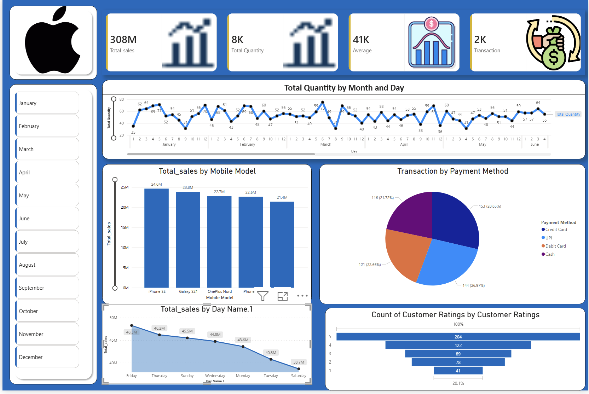

# 📊 Apple Sales Dashboard — Power BI

<p align="center">
  
  
  
</p>

<p align="center">
  <a href="mailto:YOUR_EMAIL@gmail.com">
    
  </a>
  &nbsp;
  <a href="https://www.linkedin.com/in/YOUR_LINKEDIN_HANDLE" target="_blank">
    
  </a>
</p>

---

## 🖼️ Dashboard Preview



---

## 📌 Project Overview

This is my **first Power BI project**, built as part of my journey learning data visualization and business intelligence. The dashboard analyzes Apple product sales data across multiple dimensions — time, mobile model, payment method, and customer ratings.

---

## 📈 Key Metrics

| Metric | Value |
|--------|-------|
| 💰 Total Sales | 308M |
| 📦 Total Quantity | 8K |
| 📊 Average Transaction Value | 41K |
| 🔁 Total Transactions | 2K |

---

## 🔍 Dashboard Features

- **Total Quantity by Month & Day** — Line chart tracking daily quantity trends across Jan–June
- **Total Sales by Mobile Model** — Bar chart comparing sales for iPhone SE, Galaxy S21, OnePlus Nord, iPhone, and more
- **Transaction by Payment Method** — Pie chart breaking down Credit Card, UPI, Debit Card, and Cash transactions
- **Total Sales by Day of Week** — Area chart revealing Friday as the highest sales day (48.5M) and Saturday as the lowest (38.7M)
- **Customer Ratings Distribution** — Horizontal bar chart showing rating counts from 1–5 stars
- **Month Filter Panel** — Interactive slicer for filtering data by any month (Jan–Dec)

---

## 💡 Insights

- 📅 **Friday** is the top-performing sales day; **Saturday** sees the least activity
- 📱 **iPhone SE** leads in total sales at **24.6M**, followed by Galaxy S21 at **23.6M**
- 💳 **Credit Card** is the most used payment method (**28.65%**), closely followed by **UPI (26.97%)**
- ⭐ The majority of customers gave a **5-star rating (204 reviews)**, indicating high satisfaction

---

## 🛠️ Tools Used

- **Microsoft Power BI Desktop**
- Data modeling & relationships
- DAX measures
- Custom visuals & slicers

---

## 🚀 What I Learned

- Importing and transforming data in Power Query
- Creating calculated columns and measures using **DAX**
- Designing interactive dashboards with slicers and filters
- Choosing the right chart type for each data story
- Formatting for a professional, clean visual layout

---

## 📂 Files in this Repository

```
📁 apple-sales-powerbi/
├── 📊 Apple_Sales_Dashboard.pbix     # Power BI file
├── 🖼️ dashboard_preview.png          # Dashboard screenshot
└── 📄 README.md                      # This file
```

---

## 🤝 Connect with Me

If you found this helpful or have any feedback, feel free to reach out!

<p>
  <a href="mailto:YOUR_EMAIL@gmail.com">
    
  </a>
  &nbsp;
  <a href="https://www.linkedin.com/in/YOUR_LINKEDIN_HANDLE">
    
  </a>
</p>

---

<p align="center">⭐ If you liked this project, consider giving it a star! It motivates me to keep learning and building.</p>
